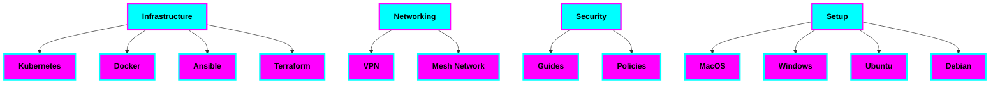

# 🏗️ Tiation Enterprise Infrastructure

<div align="center">


**Enterprise-grade infrastructure solutions with comprehensive documentation, security hardening, and professional deployment guides**

*🔒 Security First & 🚀 Production Ready & 🌐 Enterprise Scale*

[](docs/)
[](security/)
[](networking/)
[](infrastructure/)

</div>

## 🎯 Overview

This repository consolidates Tiation's enterprise infrastructure components, providing a comprehensive solution for system administration, infrastructure management, and security hardening. It follows enterprise-grade best practices and includes detailed documentation for all components.

### 🏢 Architecture



## 📂 Repository Structure

- **docs/** - Comprehensive documentation
  - `architecture/` - System architecture diagrams and documentation
  - `security/` - Security implementation guides
  - `networking/` - Network architecture and setup
  - `deployment/` - Deployment guides and procedures

- **infrastructure/** - Core infrastructure components
  - `kubernetes/` - Kubernetes configurations and manifests
  - `docker/` - Docker configurations and images
  - `ansible/` - Ansible playbooks and roles
  - `terraform/` - Infrastructure as Code templates

- **networking/** - Network configuration and management
  - `vpn/` - VPN setup and configuration
  - `mesh/` - Mesh network implementation

- **security/** - Security implementations and policies
  - `guides/` - Security hardening guides
  - `policies/` - Security policies and procedures

- **monitoring/** - System monitoring and alerting

- **setup/** - Environment setup scripts
  - `macos/` - MacOS environment setup
  - `windows/` - Windows environment setup
  - `ubuntu/` - Ubuntu environment setup
  - `debian/` - Debian environment setup

## 🚀 Quick Start

```bash
# Clone the repository
git clone https://github.com/tiation/tiation-enterprise-infrastructure.git
cd tiation-enterprise-infrastructure

# Navigate to your desired component
cd setup/ubuntu  # For Ubuntu setup
cd infrastructure/kubernetes  # For Kubernetes
```

## 📚 Documentation

- [Architecture Overview](docs/architecture/README.md)
- [Security Guidelines](docs/security/README.md)
- [Network Setup](docs/networking/README.md)
- [Deployment Guide](docs/deployment/README.md)

## 🔒 Security Features

- Hardened configurations for all components
- Security-first approach to infrastructure
- Regular security audits and updates
- Comprehensive security documentation

## 🌐 Network Features

- Enterprise VPN solutions
- Mesh network implementations
- Network security hardening
- Performance optimization

## 🛠️ Infrastructure Components

- Kubernetes cluster management
- Docker container orchestration
- Ansible automation
- Terraform infrastructure management

## 🤝 Contributing

See our [Contributing Guide](CONTRIBUTING.md) for details on how to contribute to this project.

## 📝 License

This project is licensed under the terms specified in [LICENSE](LICENSE).

## 🆘 Support

For enterprise support, contact us at [tiatheone@protonmail.com](mailto:tiatheone@protonmail.com)

---

## 🔮 Related Projects

- [Tiation AI Platform](https://github.com/tiation/tiation-ai-platform)
- [Tiation Rigger Platform](https://github.com/tiation/tiation-rigger-platform)
- [Tiation CMS](https://github.com/tiation/tiation-cms)

---
*Built with 💜 by the Tiation team*
