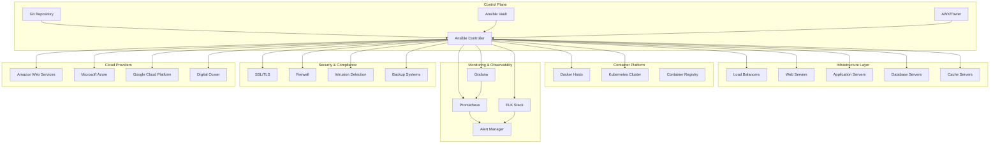
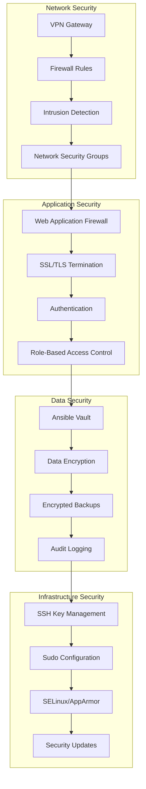
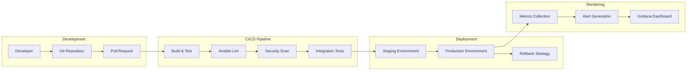

# Architecture Overview

## System Architecture

Tiation Ansible Enterprise is built with a modular, scalable architecture that supports enterprise-grade automation across multiple environments and platforms.



## Core Components

### 1. Ansible Control Node
- **Purpose**: Central orchestration and automation engine
- **Components**:
  - Ansible Core 2.11+
  - Python 3.9+ runtime
  - Custom roles and playbooks
  - Inventory management
  - Vault integration

### 2. Repository Structure
```
tiation-ansible-enterprise/
├── ansible.cfg              # Ansible configuration
├── requirements.txt         # Python dependencies
├── requirements.yml         # Ansible collections
├── playbooks/              # Automation playbooks
│   ├── site.yml            # Main deployment playbook
│   ├── github-setup.yml    # GitHub automation
│   └── security.yml        # Security hardening
├── roles/                  # Custom Ansible roles
│   ├── tiation-dark-neon-theme/
│   ├── security-hardening/
│   └── monitoring/
├── inventories/            # Environment definitions
│   ├── production/
│   ├── staging/
│   └── development/
├── group_vars/             # Group-level variables
├── host_vars/              # Host-specific variables
├── vault/                  # Encrypted secrets
├── library/                # Custom modules
├── filter_plugins/         # Custom filters
├── docs/                   # Documentation
├── tests/                  # Test suites
└── scripts/                # Utility scripts
```

### 3. Security Architecture

#### Multi-layered Security Model


#### Security Features
- **Encryption**: All secrets encrypted with Ansible Vault
- **Access Control**: SSH key-based authentication only
- **Network Security**: Firewall rules and VPN access
- **Compliance**: SOC 2, ISO 27001 ready configurations
- **Audit Trail**: Comprehensive logging and monitoring

### 4. Deployment Pipeline



### 5. Monitoring & Observability

#### Monitoring Stack
- **Prometheus**: Metrics collection and alerting
- **Grafana**: Visualization and dashboards
- **ELK Stack**: Log aggregation and analysis
- **Alert Manager**: Notification routing and management

#### Key Metrics
- **Infrastructure**: CPU, memory, disk, network utilization
- **Application**: Response times, error rates, throughput
- **Security**: Failed login attempts, security events
- **Business**: Deployment frequency, lead time, MTTR

### 6. Multi-Environment Support

#### Environment Types
- **Development**: Developer workstations and test servers
- **Staging**: Pre-production testing environment
- **Production**: Live production infrastructure
- **DR**: Disaster recovery environment

#### Environment-Specific Configurations
- **Inventory Management**: Separate inventory files per environment
- **Variable Overrides**: Environment-specific variable files
- **Secret Management**: Environment-specific vault files
- **Deployment Strategies**: Blue-green, canary, rolling updates

### 7. Scalability & Performance

#### Horizontal Scaling
- **Load Balancers**: HAProxy/Nginx for traffic distribution
- **Auto Scaling**: Dynamic resource allocation
- **Container Orchestration**: Kubernetes for microservices
- **Database Scaling**: Read replicas and sharding

#### Performance Optimization
- **Caching**: Redis/Memcached for application caching
- **CDN**: Content delivery network for static assets
- **Database Optimization**: Query optimization and indexing
- **Resource Monitoring**: Proactive performance monitoring

### 8. Disaster Recovery

#### Backup Strategy
- **Automated Backups**: Scheduled backups of all critical data
- **Cross-Region Replication**: Geographic redundancy
- **Point-in-Time Recovery**: Granular recovery options
- **Backup Validation**: Regular restore testing

#### Recovery Procedures
- **RTO**: Recovery Time Objective < 4 hours
- **RPO**: Recovery Point Objective < 1 hour
- **Failover**: Automated failover to DR environment
- **Communication**: Stakeholder notification procedures

## Integration Points

### Cloud Providers
- **AWS**: EC2, RDS, S3, CloudWatch, Route 53
- **Azure**: Virtual Machines, SQL Database, Blob Storage
- **GCP**: Compute Engine, Cloud SQL, Cloud Storage
- **Multi-Cloud**: Hybrid deployment strategies

### Third-Party Services
- **GitHub**: Source code management and CI/CD
- **Slack**: Notification and alerting
- **PagerDuty**: Incident management
- **Datadog**: Additional monitoring and APM

### API Integrations
- **REST APIs**: RESTful service integration
- **GraphQL**: Modern API query language support
- **Webhooks**: Event-driven automation
- **Message Queues**: Asynchronous processing

## Security Considerations

### Threat Model
- **Network Threats**: DDoS, man-in-the-middle attacks
- **Application Threats**: Code injection, XSS, CSRF
- **Infrastructure Threats**: Privilege escalation, data breaches
- **Social Engineering**: Phishing, insider threats

### Mitigation Strategies
- **Defense in Depth**: Multiple security layers
- **Least Privilege**: Minimal required permissions
- **Regular Updates**: Automated security patching
- **Monitoring**: Continuous security monitoring
- **Incident Response**: Defined response procedures

## Future Roadmap

### Short-term (3-6 months)
- Enhanced monitoring and alerting
- Additional cloud provider support
- Improved documentation and training
- Performance optimization

### Medium-term (6-12 months)
- Machine learning for predictive analytics
- Advanced security features
- API-first architecture
- Mobile application support

### Long-term (12+ months)
- AI-powered automation
- Edge computing support
- Blockchain integration
- Quantum-safe cryptography

## Conclusion

Tiation Ansible Enterprise provides a comprehensive, scalable, and secure automation platform that meets enterprise requirements while maintaining flexibility for future growth and innovation. The architecture is designed to support modern DevOps practices and can adapt to changing business needs.
