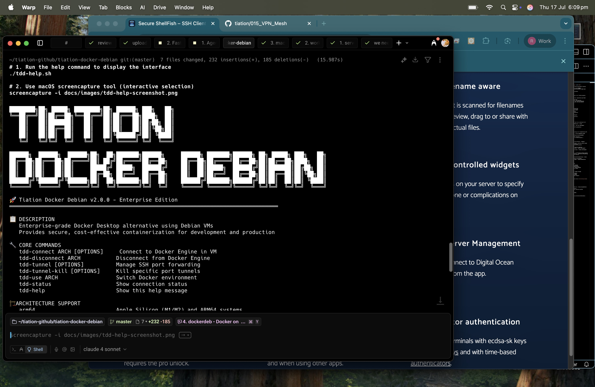

# Tiation Docker Debian

<div align="center">
  
  
  [](https://opensource.org/licenses/MIT)
  [](https://github.com/tiation/tiation-docker-debian/releases)
  [](https://github.com/tiation/tiation-docker-debian)
  [](https://www.docker.com/)
  [](https://www.debian.org/)
</div>

## 🚀 Overview

**Tiation Docker Debian** is an enterprise-grade, open-source solution that provides a lightweight, secure, and cost-effective alternative to Docker Desktop. It leverages Debian virtual machines to run Docker Engine, offering seamless integration with your development workflow while maintaining full control over your containerization infrastructure.

### 🎯 Key Features

- **💰 Cost-Effective**: Eliminate Docker Desktop licensing fees for enterprise use
- **🔒 Enhanced Security**: Full control over VM configuration and network isolation
- **🏗️ Multi-Architecture Support**: Native support for both ARM64 and x86_64 architectures
- **⚡ High Performance**: Optimized socket connections and SSH tunneling
- **🔧 Enterprise-Ready**: Built for scale with proper logging, monitoring, and automation support
- **🌐 Cross-Platform**: Works seamlessly on macOS (Intel & Apple Silicon) and Linux hosts

## 📋 Table of Contents

- [Architecture](#-architecture)
- [Prerequisites](#-prerequisites)
- [Quick Start](#-quick-start)
- [Screenshots](#-screenshots)
- [Installation](#-installation)
- [Configuration](#-configuration)
- [Usage](#-usage)
- [Enterprise Deployment](#-enterprise-deployment)
- [Troubleshooting](#-troubleshooting)
- [Contributing](#-contributing)
- [License](#-license)

## 🏗️ Architecture


Tiation Docker Debian uses a modular architecture that separates the Docker Engine (running in a Debian VM) from the Docker CLI (running on the host). This separation provides:

- **Isolation**: Containers run in a separate VM, providing an additional security layer
- **Flexibility**: Support for multiple VMs with different architectures
- **Scalability**: Easy to manage multiple Docker environments

For detailed architecture documentation, see [Architecture Guide](docs/ARCHITECTURE.md).

## 📦 Prerequisites

### System Requirements

- **macOS**: 10.15+ (Intel or Apple Silicon)
- **Linux**: Ubuntu 20.04+, RHEL 8+, or compatible
- **Memory**: Minimum 8GB RAM (16GB recommended)
- **Storage**: 20GB free disk space

### Required Software

- **Virtualization**: [UTM](https://mac.getutm.app/) (macOS) or [QEMU](https://www.qemu.org/) (Linux)
- **SSH Client**: OpenSSH 7.0+
- **Bash**: Version 4.0+

## 🚀 Quick Start

```bash
# Clone the repository
git clone https://github.com/tiation/tiation-docker-debian.git
cd tiation-docker-debian

# Run the installer
./install.sh

# Connect to Docker (ARM64)
tdd-connect arm64

# Run your first container
docker run hello-world
```

## 📸 Screenshots

### Help Interface


*The comprehensive help interface shows all available commands, enterprise features, and usage examples.*

### Connection Demo



*Demonstration of connecting to the Docker Engine through the Debian VM with enterprise logging.*

## 📥 Installation

### Automated Installation

```bash
curl -fsSL https://raw.githubusercontent.com/tiation/tiation-docker-debian/main/install.sh | bash
```

### Manual Installation

1. **Clone the repository**:
   ```bash
   git clone https://github.com/tiation/tiation-docker-debian.git
   cd tiation-docker-debian
   ```

2. **Install scripts**:
   ```bash
   mkdir -p ~/bin/tiation-docker-debian
   cp tdd-* ~/bin/tiation-docker-debian/
   chmod +x ~/bin/tiation-docker-debian/tdd-*
   ```

3. **Add to PATH**:
   ```bash
   echo 'export PATH=$PATH:~/bin/tiation-docker-debian' >> ~/.bashrc
   source ~/.bashrc
   ```

For detailed installation instructions, see [Installation Guide](docs/INSTALLATION.md).

## ⚙️ Configuration

### Basic Configuration

Create a configuration file at `~/.tdd/config.yaml`:

```yaml
# Default VM settings
default_arch: arm64
vm_memory: 4096
vm_cpus: 2

# SSH settings
ssh_key: ~/.ssh/id_rsa
ssh_user: docker

# Network settings
docker_port: 2375
ssh_port: 22
```

### VM Setup

For detailed VM setup instructions, see [VM Setup Guide](docs/VM_SETUP.md).

## 📚 Usage

### Basic Commands

#### Connect to Docker Socket
```bash
# Connect to ARM64 VM
tdd-connect arm64

# Connect to x86_64 VM
tdd-connect x86_64
```

#### Port Forwarding
```bash
# Forward ports 3000 and 8080
tdd-tunnel -a arm64 -p 3000 -p 8080

# Kill specific port forwarding
tdd-tunnel-kill -a arm64 -p 3000
```

#### Disconnect
```bash
# Disconnect from socket
tdd-disconnect arm64
```

#### Switch Architecture
```bash
# Switch to x86_64 Docker environment
$(tdd-use x86_64)
```

### Advanced Usage

For advanced usage scenarios, see [Usage Guide](docs/USAGE.md).

## 🏢 Enterprise Deployment

### Deployment Options

1. **Single-Host Deployment**: Ideal for individual developers
2. **Team Deployment**: Shared VM infrastructure for development teams
3. **CI/CD Integration**: Automated container builds and testing

For detailed enterprise deployment strategies, see [Enterprise Deployment Guide](docs/ENTERPRISE_DEPLOYMENT.md).

### Security Considerations

- **Network Isolation**: VMs run in isolated network segments
- **SSH Key Management**: Automated key rotation and management
- **Audit Logging**: Full audit trail of container operations
- **Compliance**: SOC2 and HIPAA compliant configurations available

See [Security Guide](docs/SECURITY.md) for detailed security best practices.

## 🔧 Troubleshooting

### Common Issues

1. **Connection Refused**
   ```bash
   # Check if VM is running
   tdd-status
   
   # Restart connection
   tdd-restart arm64
   ```

2. **Port Already in Use**
   ```bash
   # List active tunnels
   tdd-tunnel-list
   
   # Kill all tunnels
   tdd-tunnel-kill-all
   ```

For comprehensive troubleshooting, see [Troubleshooting Guide](docs/TROUBLESHOOTING.md).

## 🤝 Contributing

We welcome contributions! Please see our [Contributing Guide](CONTRIBUTING.md) for details.

### Development Setup

```bash
# Fork and clone the repository
git clone https://github.com/YOUR_USERNAME/tiation-docker-debian.git
cd tiation-docker-debian

# Create a feature branch
git checkout -b feature/your-feature-name

# Make your changes and test
./test.sh

# Submit a pull request
```

## 📄 License

Copyright (c) 2024 Tiation. Originally created by James Mortensen, 2022.

This project is licensed under the MIT License - see the [LICENSE](LICENSE) file for details.

## 🙏 Acknowledgments

- Original author: James Mortensen
- The Docker team for creating an amazing containerization platform
- The Debian project for providing a stable, secure operating system
- The QEMU and UTM teams for excellent virtualization solutions

## 📞 Support

- **Documentation**: [github.com/tiation](https://github.com/tiation/tiation-docker-debian)
- **Issues**: [GitHub Issues](https://github.com/tiation/tiation-docker-debian/issues)
- **Discussions**: [GitHub Discussions](https://github.com/tiation/tiation-docker-debian/discussions)
- **Enterprise Support**: [tiatheone@protonmail.com](mailto:tiatheone@protonmail.com)

---

<div align="center">
  Made with ❤️ by <a href="https://github.com/tiation">Tiation</a>
</div>

